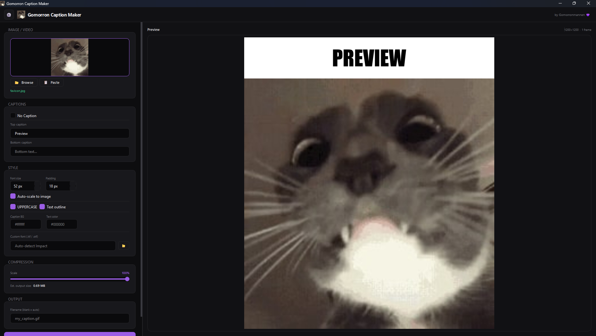

# Gomorron Caption Maker 💜

[cite_start]**Gomorron Caption Maker** is a professional-grade, minimalistic desktop application designed to create high-quality captioned GIFs and videos. [cite_start]Built with a focus on speed and a slick user experience, it allows you to overlay bold, impact-style text onto media with precise control over typography and compression.



## Core Features

* [cite_start]**Multi-Format Support**: Seamlessly process static images, animated GIFs, and various video formats including MP4, MOV, AVI, and WebM.
* [cite_start]**Intelligent Typography**: Automatic font scaling and text wrapping ensure your captions look perfect regardless of the source resolution.
* [cite_start]**High-Performance Rendering**: Powered by a multi-threaded architecture to ensure the UI remains responsive even during heavy video frame extraction.
* [cite_start]**Dynamic Theming**: Includes professionally curated color profiles such as Dark, Light, Mocha, and Midnight Blue.
* [cite_start]**Production-Ready Output**: Built-in scaling tools and size estimation help you manage files for social media sharing.
* [cite_start]**Clipboard Integration**: Supports "Ctrl+V" for pasting source images and a dedicated button to copy the finished GIF to your clipboard.

---

## Technical Stack

The tool is engineered using a robust Python stack for reliability and cross-platform compatibility:
* [cite_start]**UI Framework**: PySide6 (Qt for Python) for a hardware-accelerated, modern interface.
* [cite_start]**Image Processing**: Pillow (PIL) for advanced frame manipulation and compositing[cite: 1, 2].
* [cite_start]**Video Engine**: Integrated `ffmpeg` via `imageio-ffmpeg` for high-fidelity frame extraction[cite: 1, 2].

---

## Installation & Usage

### Running from Source
1. Ensure you have Python 3.9+ installed.
2. Install the required dependencies:
   ```bash
   pip install PySide6 Pillow imageio-ffmpeg
   ```
